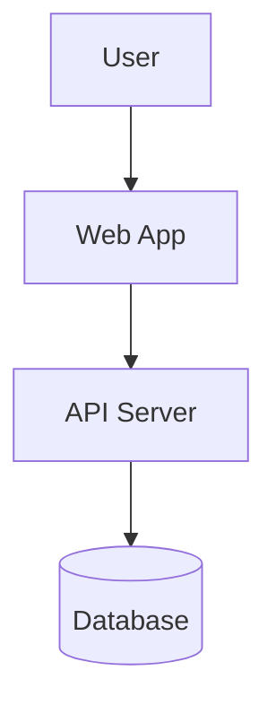
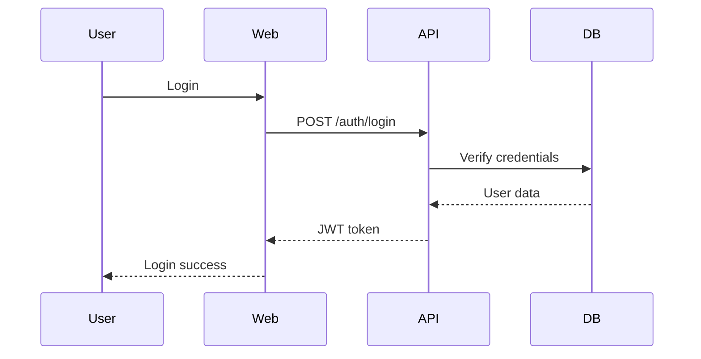

## Mandatory Reference

> 🚨 **NON-NEGOTIABLE** — every action this agent/skill takes must align with the
> 9-domain End-to-End Developer Skills Mind Map:
> [docs/audits/2026-07-11-owasp-iso25010-nist-ssdf.md](../../../docs/audits/2026-07-11-owasp-iso25010-nist-ssdf.md) (v1.0)
>
> Adopted standards: ISO/IEC/IEEE 12207, ISO/IEC 25010, IEEE 829, ISO/IEC/IEEE 29119,
> OWASP API Top 10 (2023), WCAG 2.1 AA, Diátaxis, Keep a Changelog, Conventional
> Commits, SemVer. Violation = build-blocking.


# Document Skill

## Purpose

Generate **comprehensive, clear documentation** that helps developers understand and use code effectively.

## When to Use

- New feature added
- New API endpoint
- Complex function needs explanation
- README needs updating
- API docs needed
- Architecture decision made

## Process

### Phase 1: Analyze Target

```yaml
Identify:
  - What is being documented?
  - Who is the audience?
  - What do they need to know?
  - What's the appropriate format?

Audience Types:
  End Users:
    - Focus on: What it does, how to use
    - Avoid: Internal details

  Developers:
    - Focus on: API, integration, examples
    - Include: Code samples

  Operators:
    - Focus on: Deployment, configuration, monitoring
    - Include: Troubleshooting

  Contributors:
    - Focus on: Architecture, conventions, workflow
    - Include: Setup, testing
```

### Phase 2: Plan Documentation

```yaml
Documentation Structure:

  For Functions:
    - Purpose
    - Parameters
    - Returns
    - Throws
    - Examples
    - See also

  For Classes:
    - Purpose
    - Constructor
    - Properties
    - Methods
    - Usage example

  For APIs:
    - Endpoint
    - Method
    - Auth required
    - Request format
    - Response format
    - Error codes
    - Example

  For Features:
    - Overview
    - Use cases
    - How to use
    - Configuration
    - Limitations
    - Examples

  For Components:
    - Purpose
    - Props
    - Events
    - Slots
    - Examples
    - Accessibility
```

### Phase 3: Write Documentation

```yaml
JSDoc Standards:
  - Use @param for parameters
  - Use @returns for return value
  - Use @throws for errors
  - Use @example for examples
  - Use @see for references
  - Use @deprecated if applicable
  - Use @since for version

Markdown Standards:
  - Clear headings hierarchy
  - Code blocks with language
  - Tables for structured data
  - Lists for sequential items
  - Links to related docs
  - Diagrams for complex flows
```

### Phase 4: Verify Quality

```yaml
Quality Checklist:
  Accuracy:
    - Code examples actually work
    - API signatures match code
    - No outdated information

  Completeness:
    - All public APIs documented
    - Edge cases mentioned
    - Errors documented

  Clarity:
    - Clear language
    - No jargon without explanation
    - Examples are illustrative

  Format:
    - Consistent style
    - Proper markdown
    - Links work
    - Diagrams are clear
```

## Documentation Patterns

### JSDoc for Functions

````typescript
/**
 - Calculates the discounted price for a product.
 *
 - Takes the original price and discount percentage, and returns
 - the final price after applying the discount. Optionally caps
 - the discount at a maximum amount.
 *
 - @param price - Original price in dollars (must be positive)
 - @param discountPercent - Discount percentage (0-100)
 - @param options - Additional options
 - @param options.maxDiscount - Maximum discount in dollars
 - @returns The final price after discount
 - @throws {RangeError} If price is negative or discount is invalid
 *
 - @example
 - ```typescript
 - calculateDiscount(100, 10);  // 90
 - calculateDiscount(100, 50, { maxDiscount: 30 });  // 70
 - ```
 *
 - @see {@link PricingService} for related functionality
 */
function calculateDiscount(
  price: number,
  discountPercent: number,
  options?: { maxDiscount?: number }
): number {
  // ...
}
````

### JSDoc for Classes

````typescript
/**
 - Service for managing product catalog operations.
 *
 - Handles CRUD operations, search, filtering, and pagination
 - for products. All operations are async and use parameterized
 - queries for security.
 *
 - @example
 - ```typescript
 - const service = new ProductService(db);
 - const products = await service.list({ category: 'electronics' });
 - ```
 */
class ProductService {
  /**
   - Creates a new product in the catalog.
   *
   - @param data - Product data
   - @returns Promise resolving to created product with ID
   - @throws {ValidationError} If data is invalid
   - @throws {ConflictError} If SKU already exists
   */
  async create(data: CreateProductInput): Promise<Product> {
    // ...
  }
}
````

### API Endpoint Documentation

```markdown

## POST /api/products

Creates a new product.

### Authentication

Required (Bearer token)

### Request Body

```json
{
  "name": "string (required, 1-200 chars)",
  "price": "number (required, positive)",
  "sku": "string (required, unique)",
  "category_id": "string (required, UUID)"
}
```

### Response (201 Created)

```json
{
  "success": true,
  "data": {
    "id": "uuid",
    "name": "Product Name",
    "price": 99.99,
    "sku": "PROD-001",
    "category_id": "uuid",
    "created_at": "2026-07-02T00:00:00Z"
  }
}
```

### Errors

- 400: Invalid input
- 401: Missing/invalid auth
- 409: SKU already exists
- 500: Server error
```

### README

```markdown

# Project Name

> Brief one-line description

## Features

- Feature 1
- Feature 2
- Feature 3

## Quick Start

```bash
npm install
npm run dev
```

## Documentation

- [API Reference](./docs/api.md)
- [Architecture](./docs/architecture.md)
- [Deployment](./docs/deployment.md)

## License

MIT
```

### Architecture Documentation

````markdown

# Architecture Overview

## System Context



## Components

### Frontend

- React 19 with TypeScript
- Vite build tool
- Tailwind CSS

### Backend

- Express 5 API
- PostgreSQL database
- JWT authentication

## Data Flow


````

## Documentation Locations

```yaml
Project Structure:
  /docs
    /architecture    # System design
    /api            # API reference
    /development    # Dev guides
    /operations     # Ops guides
    README.md       # Docs index

Code Locations:
  /src
    Inline JSDoc   # Function docs
    Component docs # React components
    README files   # Module docs

API Locations:
  /openapi.yaml    # OpenAPI spec
  /docs/api        # Generated docs
```

## Output Template

```markdown

## Documentation Report

### What Was Documented

[Target]

### Files Created/Updated

- `path/to/file.md` - Description
- `src/file.ts` - JSDoc added

### Audience

[Who this is for]

### Format

[Markdown / JSDoc / OpenAPI]

### Quality

- [ ] Accurate (verified against code)
- [ ] Complete (all APIs covered)
- [ ] Clear (example-driven)
- [ ] Examples tested
- [ ] Links verified
```

## Verification Checklist

- [ ] Code analyzed
- [ ] Audience identified
- [ ] Structure planned
- [ ] Content written
- [ ] Examples verified
- [ ] Links checked
- [ ] Format consistent
- [ ] Markdown lint passes

## Anti-Patterns to Avoid

```yaml
Don't:
  - Document what code does (why is better)
  - Write outdated docs
  - Use jargon without explanation
  - Skip error cases
  - Write untested examples
  - Duplicate information
  - Write walls of text (use structure)
```
