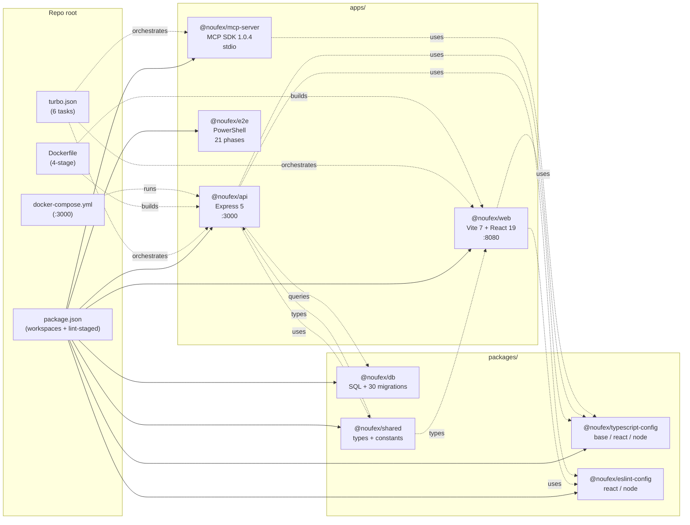
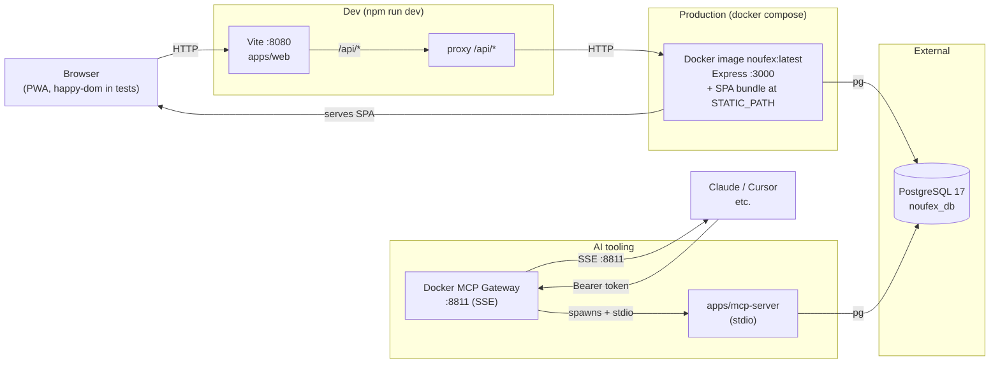
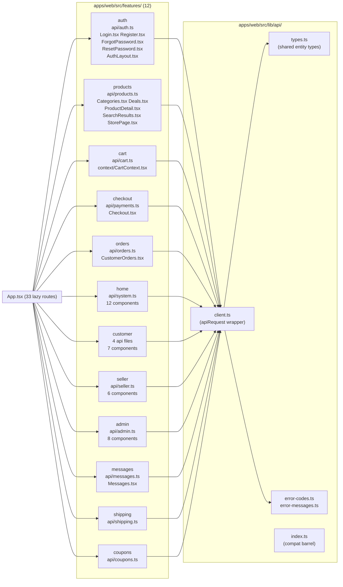
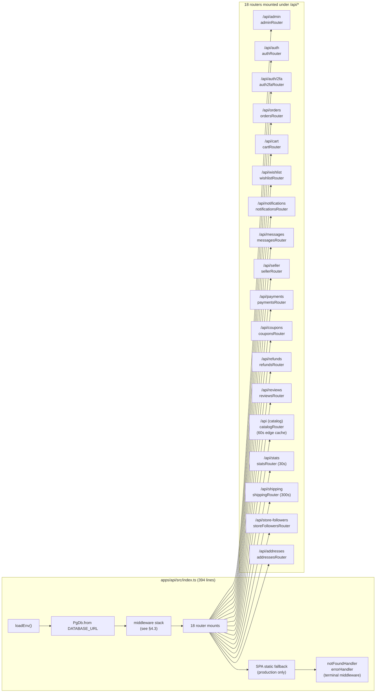
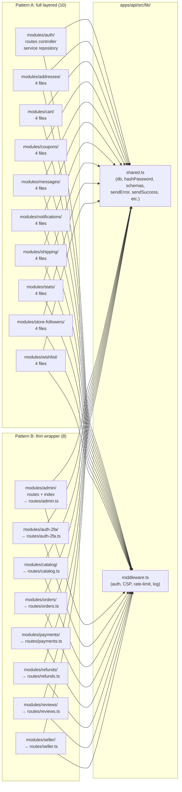
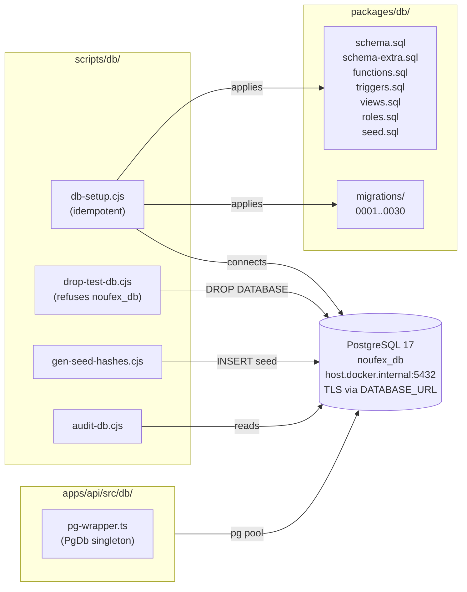
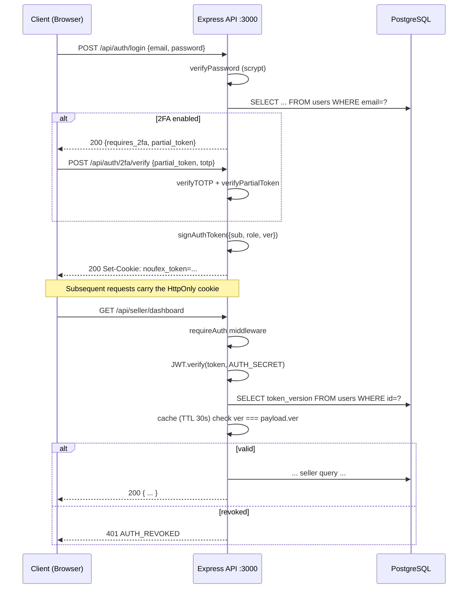
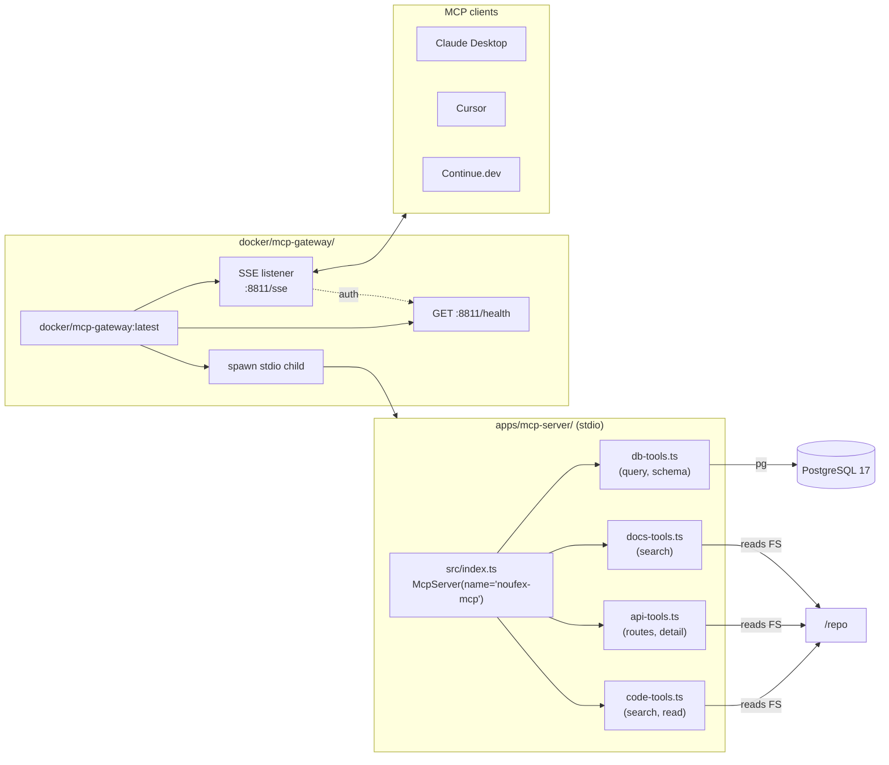
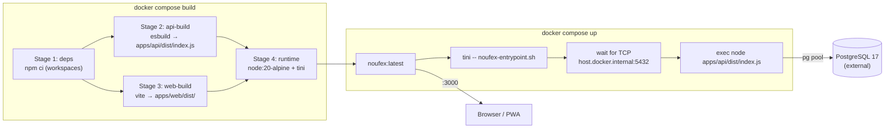

# Nouf-ex — Architecture

> **Source of truth:** every fact on this page is verified by reading the
> actual source files in this repo (commit `1c24fcb`, branch
> `fix/routes-cts-to-ts-2026-07-06`). File paths are real. Counts are from
> `ls`/`find`, not estimated.

---

## 1. Monorepo layout (npm workspaces + Turbo)

The repo is an **npm workspaces** monorepo orchestrated by **Turbo 2.10.4**.
There are **4 apps** and **4 shared packages**. Every workspace name is
scoped `@noufex/<scope>`. `package.json` at the root declares
`"workspaces": ["apps/*", "packages/*"]` and `"packageManager": "npm@10.9.0"`.

```
nouf-ex/
├── package.json              # workspaces + lint-staged + husky
├── turbo.json                # 6-task pipeline (build/typecheck/lint/test/dev/clean)
├── Dockerfile                # 4-stage multi-stage build
├── docker-compose.yml        # service: noufex on :3000
│
├── apps/                     # 4 deployable apps
│   ├── web/      @noufex/web        React 19 + Vite 7 SPA     (port 8080 dev)
│   ├── api/      @noufex/api        Express 5 REST API         (port 3000)
│   ├── mcp-server/  @noufex/mcp-server   MCP server (stdio)    (no HTTP)
│   └── e2e/      @noufex/e2e        PowerShell phase scripts   (no runtime)
│
├── packages/                 # 4 shared libs
│   ├── db/                  @noufex/db              7 SQL files + 30 migrations
│   ├── shared/              @noufex/shared          types + constants (cross-workspace)
│   ├── typescript-config/  @noufex/typescript-config  base/react/node tsconfig presets
│   └── eslint-config/      @noufex/eslint-config   react/node eslint presets
│
└── docker/
    └── mcp-gateway/         Docker MCP Gateway catalog + Dockerfile  (port 8811)
```



---

## 2. Runtime topology

| Process | Port | Reads | Writes |
|---|---|---|---|
| Browser / PWA | — | — | — |
| **Vite dev server** (npm run dev, `vite` from apps/web) | **8080** | apps/web/src/** | dev assets |
| **Express API** (tsx src/index.ts from apps/api) | **3000** | apps/api/src/** + PostgreSQL | PostgreSQL via pg |
| **PostgreSQL 17** (external, host.docker.internal) | **5432** | packages/db/** | — |
| **MCP server** (tsx src/index.ts from apps/mcp-server) | **stdio** | apps/mcp-server/src/** + PostgreSQL | — |
| **Docker MCP Gateway** (docker/mcp-gateway) | **8811** (SSE) | apps/mcp-server/dist/index.js | — |

The Vite dev server proxies `/api/*` requests to `:3000` (configured in
`vite.config.ts:135-141`). In production the same `:3000` origin serves
both the API and the SPA bundle (see static-fallback handler in
`apps/api/src/index.ts:268-300`).



---

## 3. Frontend architecture (`apps/web`)

`apps/web/package.json` confirms: **React 19.2.0**, **Vite 7.2.4**,
**react-router 7.6.1**, **tailwindcss 3.4.19**, **zustand-free** state
(React Context only), **zod 4.3.5** at the boundary.

### 3.1 Top-level wiring (`apps/web/src/main.tsx` → `App.tsx`)

`App.tsx` exports **33 `lazyPage()` route components**. Every page is
code-split into its own JS chunk — the initial bundle never pulls
`framer-motion`, `gsap`, or `recharts` unless the user navigates to a
page that uses them.

```mermaid
graph TB
  Main["apps/web/src/main.tsx"]
  App["apps/web/src/App.tsx<br/>33 × lazyPage()<br/>+ ErrorBoundary"]

  subgraph providers["Top-level providers (order matters)"]
    direction LR
    AppCtx["AppProvider<br/>(apps/web/src/context/AppContext.tsx)"]
    CartCtx["CartProvider<br/>(features/cart/context/CartContext.tsx)"]
  end

  subgraph public["Public routes (8)"]
    direction TB
    R1["/ → pages/Home"]
    R2["/search → SearchResults"]
    R3["/product/:id → ProductDetail"]
    R4["/store/:slug → StorePage"]
    R5["/categories → Categories"]
    R6["/deals → Deals"]
    R7["/checkout → Checkout"]
    R8["/messages → Messages"]
  end

  subgraph auth["Auth routes (6)"]
    direction TB
    A1["/auth/login"]
    A2["/auth/register"]
    A3["/auth/forgot-password"]
    A4["/auth/reset-password"]
    A5["/onboarding → SellerOnboarding"]
    A6["/not-found → NotFound"]
  end

  subgraph cust["Customer (5)"]
    direction TB
    C1["/customer/* (Dashboard, Orders, Wishlist, Reviews, Addresses, Notifications)"]
  end

  subgraph sell["Seller (6)"]
    direction TB
    S1["/seller/dashboard"]
    S2["/seller/products"]
    S3["/seller/orders"]
    S4["/seller/analytics"]
    S5["/seller/onboarding"]
    S6["Shared DashboardShell layout"]
  end

  subgraph admin["Admin (8)"]
    direction TB
    AD1["/admin/{overview,orders,products,stores,users,reports,disputes,audit}"]
  end

  Main --> App
  App --> AppCtx --> CartCtx
  App --> public & auth & cust & sell & admin
  cust -. ProtectedRoute .-> AppCtx
  sell -. ProtectedRoute .-> AppCtx
  admin -. ProtectedRoute .-> AppCtx
```



### 3.2 Feature-based organisation (12 features)

Every domain has the same shape:

```
apps/web/src/features/<domain>/
├── api/<domain>.ts         // fetch wrappers → @/lib/api/client
├── components/*.tsx        // page + section components
└── index.ts                // public surface re-exports
```

The 12 verified features:

| # | Feature | API | Components | Index |
|---|---|---|---|---|
| 1 | `auth/` | `api/auth.ts` | Login, Register, ForgotPassword, ResetPassword, AuthLayout | ✓ |
| 2 | `products/` | `api/products.ts` | Categories, Deals, ProductDetail, SearchResults, StorePage | ✓ |
| 3 | `cart/` | `api/cart.ts` + `context/CartContext.tsx` | — | ✓ |
| 4 | `checkout/` | `api/payments.ts` | Checkout | ✓ |
| 5 | `orders/` | `api/orders.ts` | CustomerOrders | ✓ |
| 6 | `home/` | `api/system.ts` | HeroSection, DealsBar, FeaturedMerchants, FeaturedProducts, StatsMarquee, +7 | ✓ |
| 7 | `customer/` | `api/{addresses,reviews,notifications,refunds}.ts` | CustomerDashboard, Wishlist, Reviews, etc. | ✓ |
| 8 | `seller/` | `api/seller.ts` | SellerDashboard, SellerProducts, SellerOrders, SellerAnalytics, SellerOnboarding, DashboardShell | ✓ |
| 9 | `admin/` | `api/admin.ts` | AdminOverview, AdminOrders, AdminProducts, StoresManagement, UsersManagement, ReportsAnalytics, DisputesManagement, AdminAuditLog | ✓ |
| 10 | `messages/` | `api/messages.ts` | Messages | ✓ |
| 11 | `shipping/` | `api/shipping.ts` | — | ✓ |
| 12 | `coupons/` | `api/coupons.ts` | — | ✓ |

All 12 features are **real** — verified by `docs/audit.txt` (180 files
scanned, 0 mocks, 0 mixed). The thin page shells under `apps/web/src/pages/`
just `export { default } from '@/features/<domain>/components/<Page>'`.



### 3.3 Shared primitives

`apps/web/src/components/` holds the cross-feature UI:

- `ui/`: 10 shadcn primitives (avatar, badge, button, card, dialog, input, label, separator, switch, tabs, textarea)
- `ErrorBoundary`, `Layout`, `ProtectedRoute`, `Navbar`, `BottomNav`, `Footer`, `Skeleton`, `Skeletons`, `Toast`, `ProductImage`
- `i18n/`: i18next + locales/{ar,en,zh}.json

---

## 4. Backend architecture (`apps/api`)

`apps/api/package.json` confirms: **Express 5.2.1**, **pg 8.22.0**,
**zod 4.3.5**, **tsx** for dev, **esbuild** for prod bundle, **vitest 4.1.9** for tests.

### 4.1 Bootstrap (`apps/api/src/index.ts`, 394 lines)

Order matters. The middleware chain is:

```
configureTrustProxy → requestId → securityHeaders → cors → express.json (1 MB,
verify hook captures rawBody) → urlencoded → optionalAuth → requestLogger
```

Then `app.use('/api/<route>', <router>)` for **18 routes**, with optional
`cacheControl(N, router)` wrapping for catalog (60 s), stats (30 s),
shipping (300 s).



### 4.2 Layered modules (18 modules)

Two patterns coexist:

**Pattern A — full layered (10 modules):** `auth`, `addresses`, `cart`,
`coupons`, `messages`, `notifications`, `shipping`, `stats`,
`store-followers`, `wishlist`. Each has the shape:

```
modules/<name>/
├── routes.ts       // router creation + middleware attach
├── controller.ts   // HTTP handlers (req → res)
├── service.ts      // business logic
├── repository.ts   // SQL via `db` from lib/shared.ts
└── index.ts        // re-exports { <name>Router, *Service, *Repository }
```

**Pattern B — thin wrapper (8 modules):** `admin`, `auth-2fa`, `catalog`,
`orders`, `payments`, `refunds`, `reviews`, `seller`. These modules
contain `routes.ts` + `index.ts` that re-export the existing route logic
in `apps/api/src/routes/<name>.ts` (kept as the source of truth).



### 4.3 Middleware chain (`apps/api/src/middleware.ts`)

Verified exports (top-level `export const` + `function` declarations):

| Name | Purpose |
|---|---|
| `requestId` | Sets `X-Request-Id` from `crypto.randomUUID()` or inbound header |
| `securityHeaders` | CSP (per-request nonce), HSTS, frame-options, referrer-policy |
| `log` | Structured JSON logger (`pino`-style shape, stdout) |
| `requestLogger` | Emits one JSON line per request (method, path, status, latency, userId, ip) |
| `optionalAuth` | Decodes JWT, attaches `req.user` if present, never blocks |
| `requireAuth` | Same as optional + 401 if `req.user` is missing |
| `requireRole(...roles)` | Factory: 403 if `req.user.role` not in `roles` |
| `errorHandler` | Terminal: 4-arg `(err, req, res, next)`, redacts secrets |
| `notFoundHandler` | Terminal: 404 envelope |
| `healthRateLimit` | Token-bucket limiter for `/api/health` and `/api/ready` |

JWT helpers (`signAuthToken`, `setAuthCookie`, `clearAuthCookie`,
`extractAuthToken`, `invalidateTokenVersionCache`, `getAuthSecret`) live
inline in `middleware.ts`.

### 4.4 Background sweeper

`apps/api/src/index.ts` registers a 60-second `setInterval` that calls
`SELECT cleanup_rate_limits()` and `SELECT cleanup_used_jtis()` to evict
expired rows (uses `.unref()` so it doesn't keep the process alive).

---

## 5. Database (`packages/db`)

### 5.1 SQL files (verified)

`packages/db/` contains **7 base SQL files + 30 numbered migrations**:

| File | Purpose |
|---|---|
| `schema.sql` | Core tables, enums, indexes |
| `schema-extra.sql` | Extensions to schema (constraints, defaults) |
| `functions.sql` | PL/pgSQL functions (auth helpers, search, rate-limit bucket, etc.) |
| `triggers.sql` | BEFORE/AFTER triggers (audit log, follower count, product ratings) |
| `views.sql` | Convenience views (search, analytics) |
| `roles.sql` | `postgres`, `noufex_owner`, `noufex_app`, `noufex_readonly` |
| `seed.sql` | Demo users (customer, merchant, admin) + sample stores/products |

Migrations are numbered `0001_baseline.sql` … `0030_updated_at_triggers.sql`.
They are applied by `npm run db:setup` (resolves to
`scripts/db/db-setup.cjs`).

### 5.2 Connection (`apps/api/src/db/pg-wrapper.ts`)

Single shared pool from `DATABASE_URL`. All modules reach it through
`db` from `lib/shared.ts` (exported as a `PgDb` singleton).



---

## 6. Authentication & 2FA flow

Verified by reading `modules/auth/` (5 files, 1,066 LOC total). The flow:

1. `POST /api/auth/register` — creates user with scrypt-hashed password,
   sets HttpOnly `noufex_token` cookie via `signAuthToken({ sub, role, ver })`
2. `POST /api/auth/login` — verifies password; if `two_factor_enabled`,
   issues a `partial_token` (5-minute TTL) instead
3. `POST /api/auth/2fa/verify` — exchanges `partial_token` + TOTP for the
   real auth cookie
4. Every protected route passes through `requireAuth` (Express
   middleware in `apps/api/src/middleware.ts`) which verifies the JWT
   against `users.token_version` (cached 30 s per `user_id`)
5. `POST /api/auth/logout` and `POST /api/auth/change-password` bump
   `users.token_version`, invalidating **all** outstanding tokens
   for that user in one UPDATE



---

## 7. MCP server & Gateway

`apps/mcp-server/` (6 files, 1,066 LOC) is an MCP SDK 1.0.4 server that
exposes **4 tool families** (verified by reading
`apps/mcp-server/src/index.ts`):

| Family | File | Tools (count) |
|---|---|---|
| `db_*` | `db-tools.ts` (339 lines) | `db_query`, `db_schema`, `db_list_tables`, … |
| `code_*` | `code-tools.ts` (212 lines) | `code_search`, `code_read`, … |
| `api_*` | `api-tools.ts` (255 lines) | `api_routes`, `api_route_detail` |
| `docs_*` | `docs-tools.ts` (119 lines) | `docs_search` |

It runs on **stdio** (no HTTP). For network access it's wrapped by the
**Docker MCP Gateway** (`docker/mcp-gateway/`), which:

- listens on **TCP 8811** with **SSE** transport (`/sse?sessionid=…`)
- reads `catalog.yaml` to know which stdio servers to spawn
- requires a `Bearer` token (printed on first run; visible in stderr)
- exposes `/health` on the same port for liveness probes



---

## 8. Docker build & deploy

`Dockerfile` (verified, multi-stage):

| Stage | Base | Output |
|---|---|---|
| 1. `deps` | node:20-alpine | `/build/node_modules` (workspace-wide `npm ci`) |
| 2. `api-build` | node:20-alpine | `apps/api/dist/index.js` (esbuild, external deps) |
| 3. `web-build` | node:20-alpine | `apps/web/dist/` (vite build) |
| 4. `runtime` | node:20-alpine + tini | final image, `USER node`, exposes 3000 |

`docker-compose.yml` mounts `.env`, sets `DATABASE_URL` /
`STATIC_PATH=/app/apps/web/dist`, healthcheck polls `/api/health`.



---

## 9. CI / GitHub automation

`dependabot.yml` (verified) covers **4 workspaces** post-monorepo:

| Directory | Group labels | Ignore |
|---|---|---|
| `/apps/web` | `web-production`, `web-development` | — |
| `/apps/api` | `api-production`, `api-development` | `express`, `pg`, `jsonwebtoken`, `zod` |
| `/apps/mcp-server` | (single group) | — |
| `/packages/shared` | (single group) | — |
| `/` (GitHub Actions) | `actions-group` | — |

Pre-commit hook: `.husky/pre-commit` runs `npx lint-staged` from the
repo root; `lint-staged` config lives in root `package.json` and
matches `*.{ts,tsx,cts}` to `eslint --fix --max-warnings=0` + `prettier`,
and `*.{js,cjs,mjs,json,md,css}` to `prettier --write`.

---

## 10. Cross-workspace TypeScript paths

`apps/api/tsconfig.json` declares:

```json
"paths": {
  "@noufex/web/*": ["../web/*"]
}
```

This lets API test fixtures import the web types for cross-checking
without a hard dependency on the `@noufex/web` package. Cross-package
type drift is caught at typecheck time (`turbo run typecheck`).

---

## 11. What lives where (cheat sheet)

| I want to… | Open |
|---|---|
| Add a new product page | `apps/web/src/features/products/components/` |
| Add a new `/api/orders/…` endpoint | `apps/api/src/modules/orders/` (then keep `apps/api/src/routes/orders.ts` thin) |
| Change the auth cookie name | `apps/api/src/middleware.ts` (`setAuthCookie` / `clearAuthCookie`) |
| Add a new MCP tool | `apps/mcp-server/src/<family>-tools.ts` + register in `index.ts` |
| Add a new DB migration | `packages/db/migrations/NNNN_<name>.sql` |
| Update the PWA manifest | `apps/web/vite.config.ts` (`VitePWA({ manifest })`) |
| Update CSP rules | `apps/api/src/middleware.ts` (`securityHeaders`) |
| Update the Docker healthcheck | `docker-compose.yml` (line 71–77) |

---

## Appendix A — Verified counts

| Metric | Value | How verified |
|---|---|---|
| Frontend features | 12 | `ls apps/web/src/features/` |
| Backend modules | 18 | `ls apps/api/src/modules/` |
| Routes in App.tsx | 33 | `grep -c "lazyPage" apps/web/src/App.tsx` |
| SQL base files | 7 | `ls packages/db/*.sql` |
| Migrations | 30 | `ls packages/db/migrations/` |
| MCP tool families | 4 | `ls apps/mcp-server/src/*-tools.ts` |
| Docker stages | 4 | reading `Dockerfile` `FROM … AS …` blocks |
| Shared workspaces | 4 | `ls packages/` (db, shared, typescript-config, eslint-config) |
| Middleware exports | 14 | `grep "^export " apps/api/src/middleware.ts` |
| Catalog tools | 5 | `grep "^  - name:" docker/mcp-gateway/catalog.yaml` |