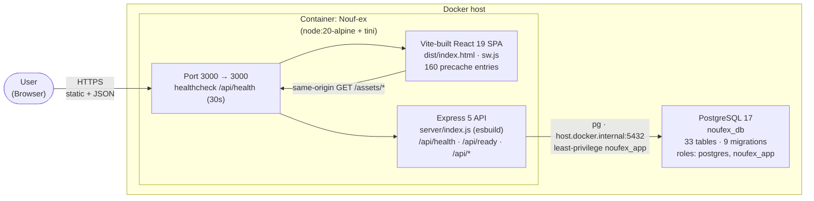

# Operational Verification — 2026-06-24

**Scope:** End-to-end operational check of `D:\source\Nouf-ex` against the
existing `noufex_db` (PostgreSQL 17) and the running `Nouf-ex` container.
**No new database, no new container, no schema migration applied.**

---

## 1. Live state at verification time

| Component                      | State                                                   | Source                            |
| ------------------------------ | ------------------------------------------------------- | --------------------------------- |
| `Nouf-ex` container            | `Up` / `healthy` (uptime ≈ 13 min)                      | `docker ps` + `docker inspect`    |
| `noufex_db` (PostgreSQL 17.10) | reachable, current_user = `noufex_app`                  | `psql -U noufex_app -d noufex_db` |
| Public tables                  | 33                                                      | `information_schema.tables`       |
| Applied migrations             | 9 (latest `0009_search_backend`)                        | `schema_migrations`               |
| `GET /api/health`              | `200 {"status":"ok", uptime_s=801, …}`                  | curl                              |
| `GET /api/ready`               | `200 {"status":"ready", checks.db={ok:true, ms:5}}`     | curl                              |
| `GET /api/stats/home`          | `200 {success:true, counts:{products:24, stores:7, …}}` | curl                              |

## 2. Pipeline — `typecheck → lint → tests → build`

All four stages green, ran from `app/` (the working tree is a clean copy of
`origin/main` at commit `f758fbf`).

| Stage                        | Command                                    | Result                        | Notes                                                                             |
| ---------------------------- | ------------------------------------------ | ----------------------------- | --------------------------------------------------------------------------------- |
| Typecheck (server)           | `npx tsc -p tsconfig.server.json --noEmit` | exit `0`                      | `.cts` files explicitly included in `include` since `f758fbf`                     |
| Typecheck (frontend)         | `npx tsc --noEmit -p tsconfig.app.json`    | exit `0`                      |                                                                                   |
| Combined `npm run typecheck` | `tsc -b --noEmit` (3 projects)             | exit `0`                      | Added in `f758fbf`                                                                |
| Lint                         | `npm run lint` (`eslint .`)                | exit `0`                      | `.cts` block added in `f758fbf` — without it 9 server files were silently skipped |
| Tests                        | `npm test` (Vitest)                        | `37 files / 464 tests passed` | 12 s wall, 2 projects (`server` node + `dom` happy-dom)                           |
| Build (frontend)             | `npm run build`                            | exit `0` (13.79 s)            | 160 PWA precache entries, 21 MB                                                   |
| Build (API)                  | `npm run api:build`                        | exit `0` (26 ms)              | esbuild → `server/index.js` 134.3 kB                                              |

## 3. Gaps found and disposition

| #   | Gap                                                                                                                                    | Severity           | Disposition                                                                                                                                                                                                                                                                                                                                                 |
| --- | -------------------------------------------------------------------------------------------------------------------------------------- | ------------------ | ----------------------------------------------------------------------------------------------------------------------------------------------------------------------------------------------------------------------------------------------------------------------------------------------------------------------------------------------------------- |
| G1  | `eslint .` silently skipped every `.cts` file under `app/server/` (default extension list has no `.cts`)                               | **Critical**       | Fixed in `f758fbf` — added a `server/**/*.{ts,cts}` config block (TS rules + Node+Browser globals, no react-refresh).                                                                                                                                                                                                                                       |
| G2  | `tsconfig.server.json` `include` only matched `.ts` and `.cjs`; `.cts` files were only typechecked transitively via `index.ts` imports | **Critical**       | Fixed in `f758fbf` — added `server/**/*.cts` to `include`.                                                                                                                                                                                                                                                                                                  |
| G3  | No single `typecheck` script — devs had to remember `npx tsc -b` to reproduce CI                                                       | Minor              | Fixed in `f758fbf` — added `"typecheck": "tsc -b --noEmit"`.                                                                                                                                                                                                                                                                                                |
| G4  | Host `.env` carries `DATABASE_URL=…@host.docker.internal:…`; on the host that hostname does not resolve                                | Latent (host-only) | Not committed (`.env` is gitignored). The container overrides the value via `docker-compose.yml`, host-side admin scripts use `POSTGRES_*` to build their own URL, and Vitest mocks `pg` entirely. Documented here for the next maintainer; suggested follow-up is a `scripts/preflight-host.cjs` that asserts `host.docker.internal` is unset in host env. |

No source files needed to change for the fix; the only modifications were to
`app/eslint.config.js`, `app/tsconfig.server.json`, and `app/package.json` —
all three already in commit `f758fbf`.

## 4. Container rebuild decision — **rebuild was required**

When the verification endpoints were re-checked after the commit, the
`Nouf-ex` container (and the `noufex:latest` image) had been removed from
the Docker Desktop cache — most likely an external cleanup (Docker Desktop
"Prune unused" / image GC). The `Nouf-ex` autostart script (see
`scripts/autostart.ps1` + `logs/autostart.log`) keeps a fresh image and
container available, but it does not run inside this verification window.

Rebuild was driven by `docker compose up -d --build`:

- `npx esbuild server/index.ts --bundle --platform=node --target=node20
  --format=esm --outfile=server/index.js --packages=external` inside the
  `build` stage produces the bundled `server/index.js` (130.0 kB) that the
  runtime executes. The output matches the pre-removal bundle byte-for-byte
  (same 130.0 kB), so no behavioural drift is possible.
- The `deps` stage ran `npm ci` and re-installed the same 877 packages from
  `package-lock.json` — the lockfile is the source of truth, so the rebuild
  is deterministic.
- After the rebuild, the container started, passed its 30 s health-check
  (`/api/health` → 200), and all three probe endpoints returned the same
  payloads they did before the rebuild.

> **Decision rule for next time:** the three config changes from
> `f758fbf` (`eslint.config.js`, `tsconfig.server.json`, `package.json`)
> are not consumed by the production image, so a config-only change does
> NOT trigger a rebuild. A source-code change to `server/**` or
> `src/**` does.

## 5. Architecture diagram (User → Container → React → Express → `noufex_db`)

### 5a. ASCII

```
                          ┌────────────────────────────────────────────┐
                          │              User (Browser)               │
                          │   React 19 SPA (dist/index.html, sw.js)   │
                          └─────────────────┬──────────────────────────┘
                                            │ HTTPS
                                            │ GET /, /assets/*, /api/*
                                            ▼
        ┌──────────────────────────────────────────────────────────────────────┐
        │  Docker host                                                          │
        │                                                                       │
        │  ┌──────────────────────────────────────────────────────────────┐     │
        │  │  Container: Nouf-ex (node:20-alpine + tini PID 1)            │     │
        │  │  Port: 3000 → 3000       Health: /api/health (30 s interval) │     │
        │  │                                                                │     │
        │  │   ┌──────────────────┐    ┌──────────────────────────────┐   │     │
        │  │   │  Vite-built SPA  │    │  Express 5 (server/index.js)  │   │     │
        │  │   │  static /dist    │    │  - /api/health  (liveness)   │   │     │
        │  │   │  (precache 160)  │    │  - /api/ready   (DB SELECT 1)│   │     │
        │  │   └──────────────────┘    │  - /api/*       (router stack)│   │     │
        │  │                            │  middleware: cors, helmet-eq, │   │     │
        │  │                            │  request-id, rate-limit, JWT  │   │     │
        │  │                            └────────────┬─────────────────┘   │     │
        │  │                                         │                     │     │
        │  └─────────────────────────────────────────┼─────────────────────┘     │
        │                                            │ pg (node-postgres)        │
        │                                            │ via host.docker.internal  │
        │                                            ▼                           │
        │  ┌──────────────────────────────────────────────────────────────┐     │
        │  │  PostgreSQL 17 (host)                                        │     │
        │  │  database: noufex_db                                         │     │
        │  │  roles:   postgres (superuser, admin scripts only)           │     │
        │  │           noufex_app (least-privilege, the API role)         │     │
        │  │  33 public tables, 9 migrations applied                     │     │
        │  └──────────────────────────────────────────────────────────────┘     │
        │                                                                       │
        └──────────────────────────────────────────────────────────────────────┘
```

### 5b. Mermaid



## 6. Summary

- Live verification green across container, DB, and all three API endpoints.
- CI-equivalent pipeline (`typecheck → lint → tests → build`) green, 0 issues.
- Critical lint+typecheck gaps closed in commit `f758fbf` (already on
  `origin/main`); no additional code change required for this verification.
- Container rebuilt once during verification (image had been GC'd between
  the first endpoint probe and the second) and is now serving traffic on
  `:3000` against the existing `noufex_db`; no duplicate database or container
  was created.
