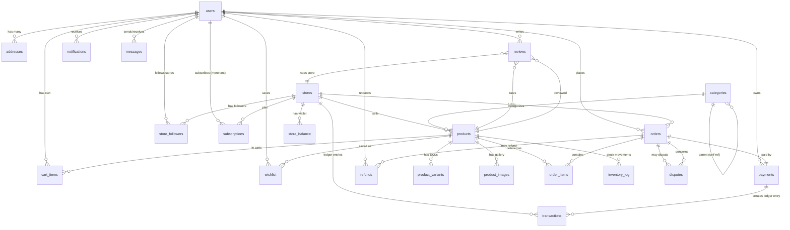
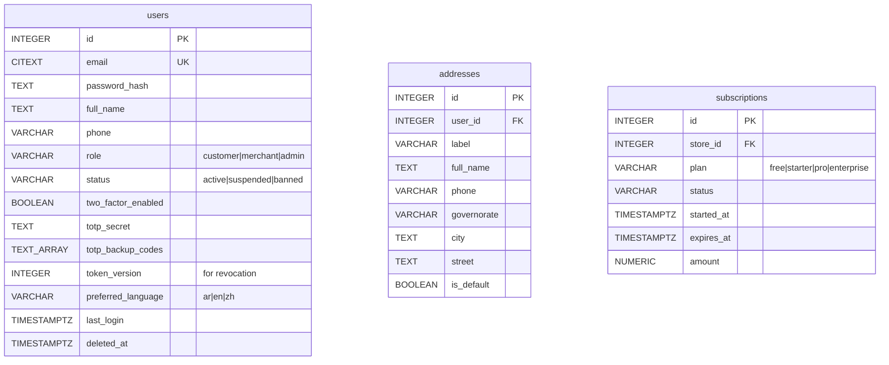
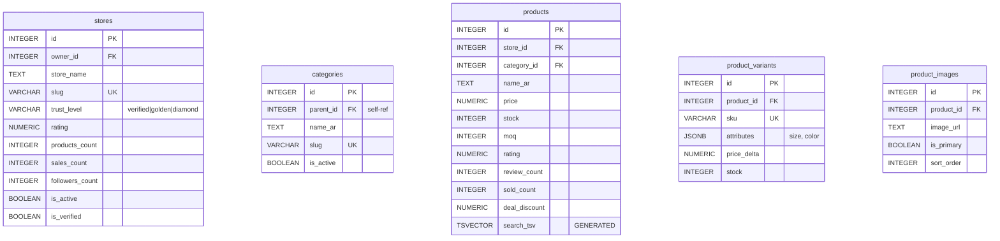
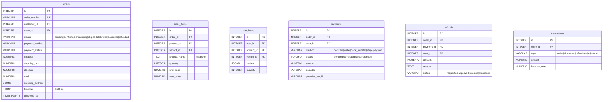
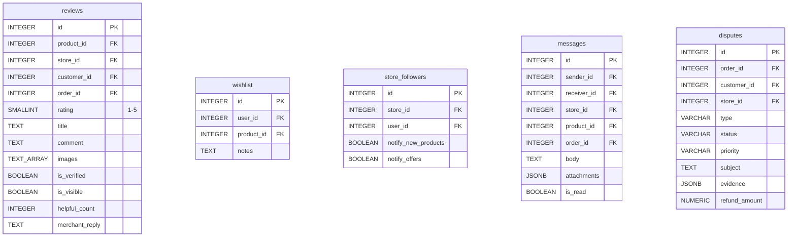

# Nouf-ex — ER Diagram (Mermaid)

> **Audience:** database designers, onboarding devs.
> **Last updated:** 2026-07-12
> **Source:** [`packages/db/schema.sql`](../../packages/db/schema.sql) + 30 migrations.

## Core entities

## Detailed relationships

### Users & Auth

### Stores & Products

### Orders & Payments

### Reviews & Social

### System tables

```mermaid
erDiagram
    notifications {
        INTEGER id PK
        INTEGER user_id FK
        VARCHAR type "order|message|review|promo|system|dispute|refund"
        TEXT title
        TEXT body
        JSONB data
        BOOLEAN is_read
        TIMESTAMPTZ read_at
    }

    coupons {
        INTEGER id PK
        VARCHAR code UK
        VARCHAR type "percentage|fixed"
        NUMERIC value
        NUMERIC min_order_amount
        NUMERIC max_discount
        INTEGER usage_limit
        INTEGER usage_count
        INTEGER per_user_limit
        INTEGER store_id FK "NULL=site-wide"
        BOOLEAN is_active
    }

    coupon_usage {
        INTEGER id PK
        INTEGER coupon_id FK
        INTEGER user_id FK
        INTEGER order_id FK
        NUMERIC discount_amount
    }

    inventory_log {
        INTEGER id PK
        INTEGER product_id FK
        INTEGER store_id FK
        INTEGER change_amount
        VARCHAR reason
    }

    admin_audit_log {
        INTEGER id PK
        INTEGER user_id FK
        VARCHAR action
        VARCHAR entity_type
        VARCHAR entity_id
        JSONB old_values
        JSONB new_values
        INET ip_address
    }

    rate_limit_buckets {
        INTEGER id PK
        VARCHAR bucket
        VARCHAR key
        INTEGER count
        TIMESTAMPTZ reset_at
    }

    used_jtis {
        INTEGER id PK
        VARCHAR jti UK
        INTEGER user_id FK
        TIMESTAMPTZ expires_at
    }

    app_settings {
        VARCHAR key PK
        TEXT value
        TIMESTAMPTZ updated_at
        INTEGER updated_by FK
    }

    webhook_events {
        BIGSERIAL id PK
        VARCHAR provider
        VARCHAR event_id
        VARCHAR transaction_id
        VARCHAR event_type
        JSONB payload
        VARCHAR processing_state
    }

    search_logs {
        BIGSERIAL id PK
        TEXT query
        TEXT query_normalized
        INTEGER result_count
        INTEGER duration_ms
        INTEGER user_id FK
        VARCHAR request_id
    }

    schema_migrations {
        VARCHAR version PK
        TEXT description
        TIMESTAMPTZ applied_at
        TEXT checksum
    }
```

---

## Cardinality quick reference

| Relationship | Cardinality | Notes |
|---|---|---|
| user → addresses | 1:N | One default (partial UNIQUE index) |
| user → orders | 1:N | Customer only |
| store → orders | 1:N | Merchant only |
| user → store_followers | M:N | via store_followers |
| store → products | 1:N | ON DELETE RESTRICT |
| category → products | 1:N | ON DELETE SET NULL |
| product → variants | 1:N | ON DELETE CASCADE |
| order → order_items | 1:N | ON DELETE CASCADE |
| order → payment | 1:1 | One primary payment |
| user → review | 1:N (per product) | UNIQUE(user, product) |

---

## See also

- [Schema SQL](../../packages/db/schema.sql)
- [API reference](api.md)
- [Database reference](database.md)
- [Security model](security.md)
