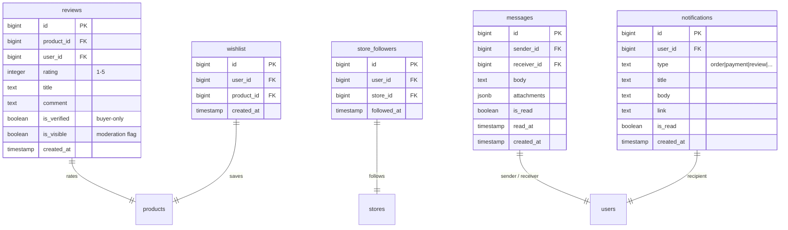
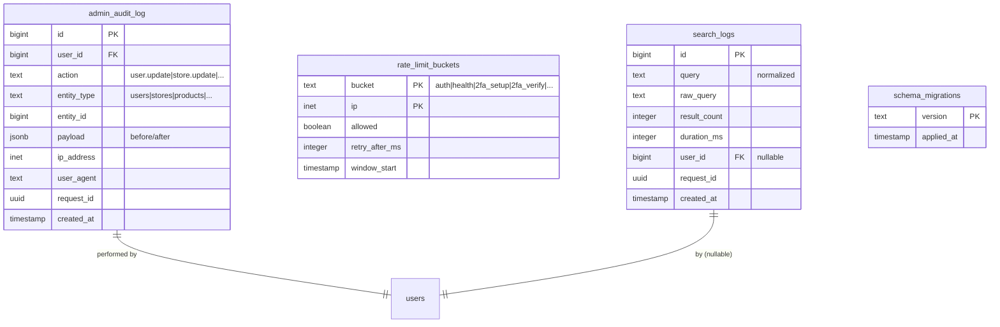

# Entity-Relationship Diagram — Nouf-ex

> **Source of truth:** `database/schema.sql`, `database/schema-extra.sql`, `database/migrations/*.sql`
> **Format:** [Mermaid](https://mermaid.js.org/) (renders in GitHub, GitLab, VS Code, Obsidian).
> **Last reviewed:** 2026-06-28
> **Audience:** Engineers, DBAs, data architects.

---

## Table of Contents

1. [Diagram conventions](#1-diagram-conventions)
2. [Master ERD](#2-master-erd)
3. [Per-domain diagrams](#3-per-domain-diagrams)
   - [3.1 Identity + Auth](#31-identity--auth)
   - [3.2 Catalog (products, stores, categories)](#32-catalog)
   - [3.3 Commerce (orders, payments, refunds)](#33-commerce)
   - [3.4 Social (reviews, wishlist, followers, messages)](#34-social)
   - [3.5 Infrastructure (audit, rate limit, search logs)](#35-infrastructure)
4. [Foreign-key matrix](#4-foreign-key-matrix)
5. [Index inventory](#5-index-inventory)
6. [Common query patterns](#6-common-query-patterns)
7. [References](#7-references)

---

## 1. Diagram conventions

| Symbol | Meaning |
|--------|---------|
| `PK` | Primary key |
| `FK` | Foreign key |
| `UQ` | Unique constraint |
| `IDX` | Index |
| `CHECK` | Check constraint |
| `🔒` | INSERT via trigger only (no direct app write) |
| `🕐` | `updated_at` auto-managed |
| `🗑️` | Soft-delete via `deleted_at` |

**Notation:**

- Only the **most-important columns** are shown per table (PK + key FKs + sample data columns).
- Lines are FK relationships (`||--o{` = one-to-many, `||--||` = one-to-one).
- Comments on lines explain the relationship (`"owns"`, `"contains"`, etc.).

---

## 2. Master ERD

The full database has **~30 tables** organized in **6 functional domains**.

```mermaid
erDiagram
    users ||--o{ addresses              : "owns"
    users ||--o{ orders                : "places"
    users ||--o{ cart_items            : "owns"
    users ||--o{ wishlist              : "owns"
    users ||--o{ reviews               : "writes"
    users ||--o{ messages              : "sends/receives"
    users ||--o{ notifications         : "receives"
    users ||--o{ disputes              : "opens"
    users ||--o{ refunds               : "requests"
    users ||--o{ store_followers       : "follows"
    users ||--o{ used_jtis             : "consumes"
    users ||--o{ admin_audit_log       : "performs"

    users ||--|| store_balance?        : "merchant owns"
    users ||--o{ stores                : "merchants own"

    stores ||--o{ products             : "sells"
    stores ||--o{ store_followers      : "has followers"
    stores ||--o{ reviews              : "receives"
    stores ||--|| store_balance        : "tracks"

    categories ||--o{ categories       : "parent of"
    categories ||--o{ products         : "categorizes"

    products ||--o{ product_variants   : "has"
    products ||--o{ product_images     : "has"
    products ||--o{ order_items        : "in"
    products ||--o{ cart_items         : "in"
    products ||--o{ wishlist           : "in"
    products ||--o{ reviews            : "rated"
    products ||--o{ inventory_log      : "tracked in"
    products ||--o{ coupons            : "applicable"

    orders ||--o{ order_items          : "contains"
    orders ||--o{ payments            : "paid by"
    orders ||--o{ refunds             : "refunded by"
    orders ||--o{ disputes            : "may have"
    orders ||--|| transactions?       : "logged in"

    coupons ||--o{ coupon_usage       : "redeemed"

    subscriptions ||--o{ users         : "subscribes"

    search_logs ||--o{ users           : "by"
    rate_limit_buckets ||--o{ users    : "limits"

    schema_migrations ||--|| schema_migrations : "tracks versions"

    users {
        bigint id PK
        citext email UQ
        text password_hash
        text full_name
        text phone
        text avatar
        text role "customer|merchant|admin"
        text status "active|banned|..."
        boolean is_verified
        boolean two_factor_enabled
        text totp_secret
        text totp_backup_codes
        text preferred_language "ar|en|zh"
        text gender "male|female|other"
    }

    stores {
        bigint id PK
        bigint owner_id FK
        text store_name
        text name_ar
        text name_en
        text description
        text logo_url
        text banner_url
        text city
        text governorate
        boolean is_active
        numeric rating
    }

    categories {
        bigint id PK
        text slug UQ
        text name_ar
        text name_en
        text name_zh
        text icon
        bigint parent_id FK "self-ref"
        integer sort_order
    }

    products {
        bigint id PK
        bigint store_id FK
        bigint category_id FK
        text name_ar
        text name_en
        text name_zh
        text slug UQ
        numeric price
        numeric original_price
        integer stock
        integer sold_count
        numeric rating
        integer review_count
        boolean is_featured
        numeric deal_discount
        tsvector search_tsv IDX "GIN"
    }

    orders {
        bigint id PK
        bigint user_id FK
        text order_number UQ "ORD-XXXXXXXX"
        text status "pending|confirmed|..."
        text payment_method "cod|card|wallet|..."
        numeric subtotal
        numeric shipping_cost
        numeric discount
        numeric total
        jsonb shipping_address
        text notes
        timestamp created_at
        timestamp updated_at
    }

    payments {
        bigint id PK
        bigint order_id FK
        text method
        numeric amount
        text currency
        text status "pending|completed|failed"
        text provider "stripe|paymob|stub"
        jsonb provider_meta
    }

    reviews {
        bigint id PK
        bigint product_id FK
        bigint user_id FK
        integer rating "1-5"
        text title
        text comment
        boolean is_verified
        boolean is_visible
    }

    admin_audit_log {
        bigint id PK
        bigint user_id FK
        text action
        text entity_type
        bigint entity_id
        jsonb payload
        inet ip_address
        text user_agent
        uuid request_id
    }
```

---

## 3. Per-domain diagrams

### 3.1 Identity + Auth

```mermaid
erDiagram
    users {
        bigint id PK
        citext email UQ
        text password_hash "scrypt"
        text full_name
        text phone
        text role
        text status
        boolean is_verified
        boolean two_factor_enabled
        text totp_secret
        text totp_backup_codes "scrypt-hashed array"
        text preferred_language
        text gender
        timestamp last_login
    }

    addresses {
        bigint id PK
        bigint user_id FK
        text label
        text full_name
        text phone
        text governorate
        text city
        text district
        text street
        text building
        text notes
        boolean is_default
    }

    used_jtis {
        bigint id PK
        text jti UQ "JWT id"
        bigint user_id FK
        timestamp used_at
    }

    subscriptions {
        bigint id PK
        bigint user_id FK
        text plan
        text status
        timestamp expires_at
    }

    users ||--o{ addresses      : "owns"
    users ||--o{ used_jtis      : "burns tokens"
    users ||--o{ subscriptions  : "pays for"
```

---

### 3.2 Catalog (products, stores, categories)

```mermaid
erDiagram
    stores {
        bigint id PK
        bigint owner_id FK
        text store_name
        text slug UQ
        text name_ar
        text name_en
        text description
        text logo_url
        text banner_url
        text phone
        text city
        text governorate
        boolean is_active
        numeric rating
        integer products_count
    }

    categories {
        bigint id PK
        text slug UQ
        text name_ar
        text name_en
        text name_zh
        text icon
        bigint parent_id FK "self-ref for subcategories"
        integer sort_order
    }

    products {
        bigint id PK
        bigint store_id FK
        bigint category_id FK
        text name_ar
        text name_en
        text name_zh
        text slug UQ
        text sku
        numeric price
        numeric original_price
        integer stock
        integer sold_count
        numeric rating
        integer review_count
        text main_image
        jsonb images
        jsonb features
        jsonb badges
        boolean is_active
        boolean is_featured
        boolean is_deleted
        numeric deal_discount
        jsonb metadata
        tsvector search_tsv IDX "GIN idx_products_search"
        timestamp created_at
    }

    product_variants {
        bigint id PK
        bigint product_id FK
        text sku UQ
        text name
        numeric price
        integer stock
        jsonb attributes
    }

    product_images {
        bigint id PK
        bigint product_id FK
        text url
        text alt_text
        integer sort_order
        boolean is_primary
    }

    store_balance {
        bigint id PK
        bigint store_id FK UQ "1:1"
        numeric available
        numeric pending
    }

    stores ||--o{ products             : "sells"
    stores ||--|| store_balance        : "tracks"
    categories ||--o{ categories       : "parent of (self-ref)"
    categories ||--o{ products         : "categorizes"
    products ||--o{ product_variants   : "has"
    products ||--o{ product_images     : "has"
```

**Notes:**

- `categories.parent_id` self-reference enables tree structure (parent → subcategories).
- `products.search_tsv` is a `tsvector` populated by trigger; GIN index enables fast FTS.
- `store_balance` is 1:1 with `stores` (unique constraint on `store_id`).
- `product_variants` enables size/color options (not used in seed).

---

### 3.3 Commerce (orders, payments, refunds)

```mermaid
erDiagram
    cart_items {
        bigint id PK
        bigint user_id FK
        bigint product_id FK
        integer quantity
        jsonb variant
        timestamp created_at
    }

    orders {
        bigint id PK
        bigint user_id FK
        bigint store_id FK "derived from order_items"
        text order_number UQ "ORD-XXXXXXXX"
        text status "pending|confirmed|processing|shipped|delivered|cancelled"
        text payment_method "cod|card|wallet|bank_transfer"
        numeric subtotal
        numeric shipping_cost
        numeric discount
        numeric total
        jsonb shipping_address
        text notes
        jsonb timeline
        timestamp created_at
        timestamp updated_at
    }

    order_items {
        bigint id PK
        bigint order_id FK
        bigint product_id FK
        integer quantity
        numeric unit_price
        numeric total_price
        jsonb variant
    }

    payments {
        bigint id PK
        bigint order_id FK
        text method
        numeric amount
        text currency
        text status "pending|completed|failed|expired"
        text provider "stripe|paymob|stub"
        text provider_payment_id "external ID"
        jsonb provider_meta
        timestamp created_at
        timestamp completed_at
    }

    refunds {
        bigint id PK
        bigint order_id FK
        bigint user_id FK
        numeric amount
        text reason
        text status "requested|approved|processed|rejected"
        text admin_notes
        timestamp requested_at
        timestamp resolved_at
    }

    transactions {
        bigint id PK
        text type "payment|refund|adjustment"
        bigint reference_id "order_id or refund_id"
        numeric amount
        text description
        timestamp created_at
    }

    disputes {
        bigint id PK
        bigint order_id FK
        bigint opened_by FK
        text subject
        text description
        text status "open|under_review|resolved|closed"
        text resolution_notes
        timestamp opened_at
        timestamp resolved_at
    }

    coupons {
        bigint id PK
        text code UQ
        text type "percentage|fixed"
        numeric value
        numeric min_order
        numeric max_discount
        integer usage_limit
        integer usage_count
        numeric store_id FK "NULL = global, else store-scoped"
        timestamp starts_at
        timestamp expires_at
        boolean is_active
    }

    coupon_usage {
        bigint id PK
        bigint coupon_id FK
        bigint order_id FK
        bigint user_id FK
        numeric discount_applied
        timestamp redeemed_at
    }

    inventory_log {
        bigint id PK
        bigint product_id FK
        text change_type "order_created|order_cancelled|adjustment"
        integer quantity_change "negative = decrease"
        integer stock_after
        text reason
        timestamp created_at
    }

    shipping_methods {
        bigint id PK
        text name_ar
        text name_en
        numeric base_cost
        numeric per_kg_cost
        integer estimated_days
        boolean is_active
    }

    orders ||--o{ order_items       : "contains"
    orders ||--o{ payments         : "paid by"
    orders ||--o{ refunds          : "may refund"
    orders ||--o{ disputes         : "may have"
    cart_items ||--o{ products      : "selected"
    coupons ||--o{ coupon_usage    : "redeemed"
```

**Notes:**

- `cart_items` is the persistent cart; orders are created FROM cart.
- `orders.store_id` is derived (no direct FK in this schema; resolved via
  order_items → products).
- `payments` uses `(order_id, method)` for idempotency.
- `inventory_log` is INSERT-only via trigger (migrations 0007).
- `coupons` has nullable `store_id` (NULL = global; non-NULL = store-scoped).
- `shipping_methods` is currently not FK-linked to orders (free-form choice at checkout).

---

### 3.4 Social (reviews, wishlist, followers, messages)



---

### 3.5 Infrastructure (audit, rate limit, search logs)



**Notes:**

- `admin_audit_log` INSERT-only via SECURITY DEFINER trigger
  (migration 0011). The `noufex_app` runtime role has **no INSERT**
  permission — only the trigger function can insert.
- `rate_limit_buckets` PK is `(bucket, ip)` (composite). Window is
  configured via `consume_rate_limit()` SQL function.
- `search_logs` is best-effort: writes are fire-and-forget (search
  failures never break user-facing search).
- `schema_migrations` is a one-row-per-applied-migration log.

---

## 4. Foreign-key matrix

Every FK in the database. **CASCADE** = delete propagates; **RESTRICT**
= delete blocked; default = no action.

| From table | From column | To table | To column | On delete |
|------------|-------------|----------|-----------|-----------|
| `addresses` | `user_id` | `users` | `id` | CASCADE |
| `cart_items` | `user_id` | `users` | `id` | CASCADE |
| `cart_items` | `product_id` | `products` | `id` | RESTRICT |
| `categories` | `parent_id` | `categories` | `id` | SET NULL |
| `coupon_usage` | `coupon_id` | `coupons` | `id` | CASCADE |
| `coupon_usage` | `order_id` | `orders` | `id` | CASCADE |
| `coupon_usage` | `user_id` | `users` | `id` | CASCADE |
| `disputes` | `order_id` | `orders` | `id` | CASCADE |
| `disputes` | `opened_by` | `users` | `id` | SET NULL |
| `inventory_log` | `product_id` | `products` | `id` | RESTRICT |
| `messages` | `sender_id` | `users` | `id` | CASCADE |
| `messages` | `receiver_id` | `users` | `id` | CASCADE |
| `notifications` | `user_id` | `users` | `id` | CASCADE |
| `order_items` | `order_id` | `orders` | `id` | CASCADE |
| `order_items` | `product_id` | `products` | `id` | RESTRICT |
| `orders` | `user_id` | `users` | `id` | RESTRICT |
| `payments` | `order_id` | `orders` | `id` | CASCADE |
| `product_images` | `product_id` | `products` | `id` | CASCADE |
| `product_variants` | `product_id` | `products` | `id` | CASCADE |
| `products` | `store_id` | `stores` | `id` | RESTRICT |
| `products` | `category_id` | `categories` | `id` | SET NULL |
| `refunds` | `order_id` | `orders` | `id` | CASCADE |
| `refunds` | `user_id` | `users` | `id` | SET NULL |
| `reviews` | `product_id` | `products` | `id` | CASCADE |
| `reviews` | `user_id` | `users` | `id` | SET NULL |
| `search_logs` | `user_id` | `users` | `id` | SET NULL |
| `store_balance` | `store_id` | `stores` | `id` | CASCADE |
| `store_followers` | `store_id` | `stores` | `id` | CASCADE |
| `store_followers` | `user_id` | `users` | `id` | CASCADE |
| `stores` | `owner_id` | `users` | `id` | RESTRICT |
| `subscriptions` | `user_id` | `users` | `id` | CASCADE |
| `used_jtis` | `user_id` | `users` | `id` | CASCADE |
| `wishlist` | `user_id` | `users` | `id` | CASCADE |
| `wishlist` | `product_id` | `products` | `id` | CASCADE |

**Pattern observations:**

- `users` rows are mostly **CASCADE**-deleted (personal data is deleted with the user) — GDPR-friendly.
- `products` is **RESTRICT** from order_items, cart_items, wishlist — preserves order history.
- `stores` is **RESTRICT** from products — preserves sold products after store closure.

---

## 5. Index inventory

The database has **60+ indexes** across the schema. The most-critical
ones for query performance:

| Table | Index | Columns | Purpose |
|-------|-------|---------|---------|
| `products` | `idx_products_search` (GIN) | `search_tsv` | FTS for `/api/search` |
| `products` | `idx_products_store_active` | `(store_id, is_active)` | Store filter |
| `products` | `idx_products_category_active` | `(category_id, is_active)` | Category filter |
| `products` | `idx_products_price` | `(price)` | Sort by price |
| `products` | `idx_products_featured` | `(is_featured)` WHERE TRUE | Featured list |
| `products` | `idx_products_deals` | `(deal_discount)` WHERE > 0 | Deals list |
| `orders` | `idx_orders_user_status` | `(user_id, status)` | User's order list |
| `orders` | `idx_orders_status_created` | `(status, created_at DESC)` | Admin queue |
| `orders` | `idx_orders_order_number` (UQ) | `(order_number)` | Lookup by number |
| `order_items` | `idx_order_items_order` | `(order_id)` | Order detail |
| `reviews` | `idx_reviews_product_visible` | `(product_id, is_visible)` | Product reviews |
| `reviews` | `idx_reviews_user` | `(user_id)` | User's reviews |
| `wishlist` | `idx_wishlist_user` | `(user_id)` | User's wishlist |
| `cart_items` | `idx_cart_user_product` (UQ) | `(user_id, product_id)` | Prevent dupes |
| `notifications` | `idx_notif_user_unread` | `(user_id, is_read)` WHERE FALSE | Unread badge |
| `rate_limit_buckets` | PK | `(bucket, ip)` | Rate-limit lookup |
| `coupons` | `idx_coupons_code` (UQ) | `(code)` WHERE is_active | Code lookup |
| `coupon_usage` | `idx_coupon_usage_unique` (UQ) | `(coupon_id, order_id)` | Idempotency |
| `payments` | `idx_payments_order_method` (UQ) | `(order_id, method)` | Idempotency |
| `refunds` | `idx_refunds_order_user` | `(order_id, user_id)` | User refunds |
| `admin_audit_log` | `idx_audit_user_created` | `(user_id, created_at DESC)` | User audit trail |
| `admin_audit_log` | `idx_audit_entity` | `(entity_type, entity_id)` | Per-entity trail |
| `inventory_log` | `idx_inventory_product_created` | `(product_id, created_at DESC)` | Per-product history |

(Full list: query `SELECT schemaname, tablename, indexname, indexdef FROM pg_indexes WHERE schemaname = 'public' ORDER BY tablename, indexname;`)

---

## 6. Common query patterns

Examples of complex queries the API runs and the indexes they use.

### 6.1 `/api/products` with all filters

```sql
SELECT * FROM products
WHERE is_active = TRUE
  AND deleted_at IS NULL
  AND ($1::int IS NULL OR store_id = $1)
  AND ($2::text IS NULL OR category_id = (SELECT id FROM categories WHERE slug = $2))
  AND ($3::numeric IS NULL OR price >= $3)
  AND ($4::numeric IS NULL OR price <= $4)
ORDER BY
  CASE WHEN $5 = 'price_asc'  THEN price END ASC,
  CASE WHEN $5 = 'price_desc' THEN price END DESC,
  CASE WHEN $5 = 'newest'    THEN created_at END DESC,
  sold_count DESC
LIMIT $6 OFFSET $7;
```

Uses `idx_products_store_active`, `idx_products_category_active`,
`idx_products_price`.

### 6.2 `/api/search` (full-text)

```sql
SELECT
  products.*,
  ts_rank(search_tsv, plainto_tsquery('simple', $1)) AS rank
FROM products
WHERE is_active = TRUE
  AND deleted_at IS NULL
  AND search_tsv @@ plainto_tsquery('simple', $1)
ORDER BY rank DESC
LIMIT $2 OFFSET $3;
```

Uses `idx_products_search` (GIN).

### 6.3 `/api/orders` for current user

```sql
SELECT * FROM orders
WHERE user_id = $1
  AND deleted_at IS NULL
ORDER BY created_at DESC
LIMIT $2 OFFSET $3;
```

Uses `idx_orders_user_status`.

### 6.4 `/api/admin/orders` for admin

```sql
SELECT * FROM orders
WHERE ($1::bigint IS NULL OR user_id = $1)
  AND ($2::text IS NULL OR status = $2)
  AND deleted_at IS NULL
ORDER BY created_at DESC
LIMIT $3 OFFSET $4;
```

Uses `idx_orders_status_created`.

### 6.5 Cart total (per user)

```sql
SELECT
  ci.id, ci.quantity, ci.variant,
  p.name_ar, p.name_en, p.price, p.main_image,
  s.store_name
FROM cart_items ci
JOIN products p ON ci.product_id = p.id
LEFT JOIN stores s ON p.store_id = s.id
WHERE ci.user_id = $1
ORDER BY ci.created_at DESC;
```

Uses `idx_cart_user_product`.

---

## 7. References

### 7.1 Internal documents

- [`architecture/database.md`](database.md) — schema + roles
- [`architecture/security.md`](security.md) — RBAC + audit
- [`../../database/schema.sql`](../../../../database/schema.sql) — base tables
- [`../../database/schema-extra.sql`](../../../../database/schema-extra.sql) — extra tables
- [`../../database/migrations/`](../../../../database/migrations/) — incremental migrations
- [`../../database/functions.sql`](../../../../database/functions.sql) — PL/pgSQL triggers
- [`../../database/views.sql`](../../../../database/views.sql) — 4 read-only views
- [`../../database/roles.sql`](../../../../database/roles.sql) — least-privilege roles
- [`../testing/phases/`](../../testing/phases/) — per-domain test coverage

### 7.2 External references

- [Mermaid ER syntax](https://mermaid.js.org/syntax/entityRelationshipDiagram.html)
- [PostgreSQL — Indexes](https://www.postgresql.org/docs/17/indexes.html)
- [PostgreSQL — Foreign Keys](https://www.postgresql.org/docs/17/ddl-constraints.html)
- [PostgreSQL — Triggers](https://www.postgresql.org/docs/17/triggers.html)
- [PostgreSQL — Full-Text Search](https://www.postgresql.org/docs/17/textsearch.html)

---

## Maintenance Notes

1. **Regenerate** this document from SQL when tables change. Future: script
   that parses `schema.sql` + migrations and emits Mermaid.
2. **Update §4 (FK matrix)** when FKs are added or removed.
3. **Update §5 (Index inventory)** when indexes change.
4. **Update §6 (Query patterns)** when new endpoints are added.
5. Bump version in §1 when significant changes are made.
6. Commit spec + code **together**.

---

> **End of er-diagram.md.** Next: B.2.5 — `debugging.md` (common
> patterns + reset utilities for development).