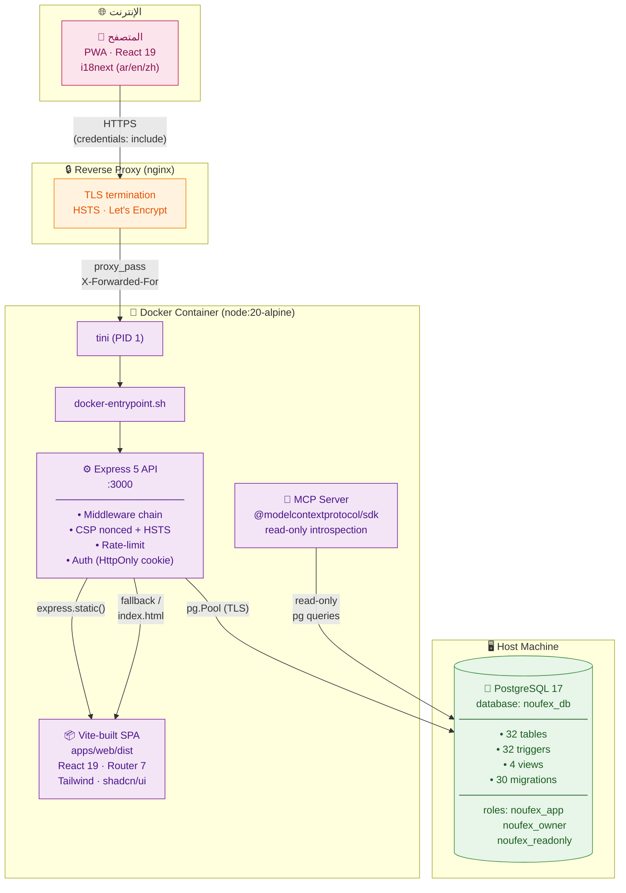
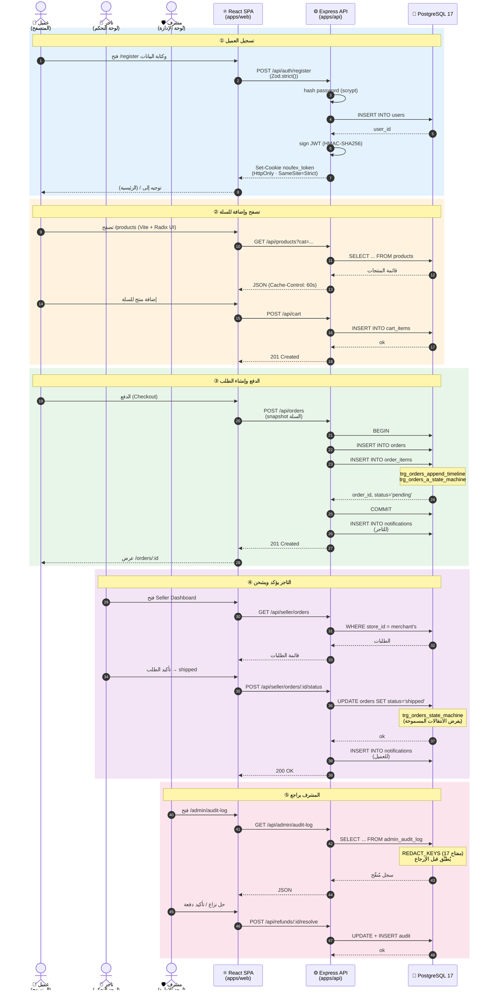

# Nouf-ex — تدفق عمل المنصة وآليات تشغيلها

> **الهدف:** توثيق مرئي شامل يوضح كيف تنتقل البيانات والطلبات عبر طبقات المنصة،
> وكيف تنتقل أدوار المستخدم (العميل / التاجر / المشرف) داخل النظام،
> وكيف يتم بناء التطبيق ونشره.

---

## 1️⃣ النظام العام — من المتصفح إلى قاعدة البيانات

> **نوع الرسم:** Deployment View · **يوضح:** البنية الفيزيائية للنظام،
> والحدود بين الحاوية وقاعدة البيانات الخارجية، وكيف يصل المتصفح إلى الـ API.



**الشرح:**

| الخطوة | الوصف |
|---|---|
| **1** | المستخدم يفتح التطبيق في المتصفح (PWA قابل للتثبيت على الجوال). |
| **2** | nginx ينهي TLS ويُضيف HSTS، ثم يُمرّر الطلب إلى المنفذ 3000 داخل الحاوية. |
| **3** | `tini` يعمل كـ PID 1 لإعادة الـ reap لأي عملية يتييمة، ثم يستدعي `noufex-entrypoint.sh`. |
| **4** | Express يُخدّم **طبقتين**: الـ SPA (ملفات ثابتة مبنية بـ Vite) والـ REST API تحت `/api/*`. |
| **5** | خادم MCP يستخدمه الذكاء الاصطناعي لقراءة المخطط والبيانات (read-only) — منفصل عن API التطبيق. |
| **6** | كل اتصال بقاعدة البيانات يمر عبر `pg.Pool` بتشفير TLS ودور `noufex_app` بأقل صلاحيات. |

---

## 2️⃣ رحلة العميل الكاملة — من التسجيل إلى استلام الطلب

> **نوع الرسم:** Sequence Diagram · **يوضح:** تدفق البيانات في سيناريو حقيقي
> (العميل يضع طلباً → التاجر يؤكد → المشرف يُراجع).



**المراحل الخمس:**

1. **التسجيل** — كلمة المرور تُشفّر بـ scrypt، ثم JWT يُوقَّع بـ HMAC-SHA256 ويُخزَّن في HttpOnly cookie.
2. **التصفح والسلة** — كتالوج عام بدون مصادقة، السلة تتطلب تسجيل دخول.
3. **إنشاء الطلب** — يحدث داخل `BEGIN/COMMIT`، وتُحرّك الـ triggers الخاصة بحالة الطلب.
4. **رد التاجر** — الـ API يفرض RBAC: التاجر يستطيع فقط تعديل طلبات متجره (`ownership-by-WHERE`).
5. **مراجعة المشرف** — كل تغيير يُسجَّل في `admin_audit_log` بعد تنقية المفاتيح الحساسة.

---

## 3️⃣ تدفق طلب HTTP — من الضغط على زر حتى الرد

> **نوع الرسم:** Flowchart · **يوضح:** الـ middleware chain في Express لكل طلب،
> من الدخول إلى الخروج، وكيف يتعامل النظام مع الأمان والتحقق.

```mermaid
flowchart TD
    Start([📨 طلب HTTP قادم]) --> CORS{CORS<br/>origin ∈<br/>ALLOWED_ORIGINS?}
    CORS -- لا --> Reject403[403 Forbidden<br/>fail-closed]
    CORS -- نعم --> Helmet[🪖 Helmet headers<br/>HSTS · CSP · X-Frame<br/>Referrer-Policy]
    Helmet --> ReqID[🆔 توليد request_id<br/>X-Request-ID header]
    ReqID --> BodyLimit{JSON ≤ 1MB?}
    BodyLimit -- لا --> Reject413[413 Payload Too Large]
    BodyLimit -- نعم --> RouteMatch{المسار؟}

    RouteMatch -- "/api/health" --> Health[GET /api/health<br/>200 OK · uptime]
    RouteMatch -- "/api/ready" --> Ready[GET /api/ready<br/>+ فحص pg ping]
    RouteMatch -- "/api/auth/*" --> RL1[⏱️ Rate-limit<br/>20 req / 15 min]
    RouteMatch -- "/api/* (آخر)" --> AuthCheck{تحتوي<br/>HttpOnly cookie?}

    RL1 --> AuthCheck
    Health --> Resp[📤 إرجاع الاستجابة]
    Ready --> Resp

    AuthCheck -- لا --> Reject401[401 AUTH_REQUIRED]
    AuthCheck -- نعم --> Verify[JWT verify<br/>timingSafeEqual]

    Verify -- فشل --> Reject401
    Verify -- نجاح --> VerCheck{token_version<br/>= users.ver?}
    VerCheck -- لا --> Reject401
    VerCheck -- نعم --> RoleCheck{Role?}

    RoleCheck -- "/api/admin/*" --> IsAdmin{admin?}
    RoleCheck -- "/api/seller/*" --> IsSeller{merchant|admin?}
    RoleCheck -- عام --> Zod

    IsAdmin -- لا --> Reject403
    IsAdmin -- نعم --> Zod
    IsSeller -- لا --> Reject403
    IsSeller -- نعم --> Zod

    Zod[🧪 Zod.strict()<br/>رفض أي حقل زائد] --> ZodFail{valid?}
    ZodFail -- لا --> Reject400[400 Validation Error]
    ZodFail -- نعم --> Handler[⚙️ Controller<br/>→ Service<br/>→ Repository]

    Handler --> SQL{prepared<br/>SQL only}
    SQL --> DB[🐘 PostgreSQL<br/>via pg.Pool]
    DB --> Audit{تغيير<br/>حساس?}
    Audit -- نعم --> WriteAudit[📝 INSERT<br/>admin_audit_log<br/>+ REDACT_KEYS]
    Audit -- لا --> Resp
    WriteAudit --> Resp
    Handler --> Resp

    Resp[📤 إرجاع الاستجابة<br/>+ JSON structured log] --> Done([✅ done])

    Reject403 -.-> Done
    Reject413 -.-> Done
    Reject401 -.-> Done
    Reject400 -.-> Done

    classDef ok fill:#c8e6c9,stroke:#2e7d32,color:#1b5e20
    classDef warn fill:#fff9c4,stroke:#f9a825,color:#5d4037
    classDef bad fill:#ffcdd2,stroke:#c62828,color:#7f1d1d
    classDef proc fill:#e1f5fe,stroke:#0277bd,color:#01579b
    classDef db fill:#f3e5f5,stroke:#6a1b9a,color:#4a148c

    class Start,Done ok
    class Reject403,Reject413,Reject401,Reject400 bad
    class CORS,BodyLimit,RouteMatch,AuthCheck,VerCheck,RoleCheck,IsAdmin,IsSeller,ZodFail,Audit warn
    class Helmet,ReqID,RL1,Verify,Zod,Handler,SQL,Resp proc
    class DB,WriteAudit db
```

**الخطوات الرئيسية لكل طلب:**

| # | الخطوة | الهدف |
|---|---|---|
| 1 | **CORS** | السماح فقط للأصول المسجّلة في `ALLOWED_ORIGINS` (fail-closed). |
| 2 | **Helmet** | إضافة CSP nonced + HSTS + X-Frame-Options DENY. |
| 3 | **Request ID** | ربط سجل الطلب بسجلات الخادم. |
| 4 | **Body limit** | حد 1MB للـ JSON و urlencoded. |
| 5 | **Rate-limit** | على `/api/auth/*` فقط (DB-backed). |
| 6 | **Auth verify** | JWT بـ `timingSafeEqual` + فحص `token_version`. |
| 7 | **RBAC** | `/admin/*` يتطلب admin، `/seller/*` يتطلب merchant أو admin. |
| 8 | **Zod strict** | يرفض أي حقل غير معروف في body. |
| 9 | **Handler** | controller → service → repository (prepared SQL). |
| 10 | **Audit** | كل تغيير حساس يُسجَّل بعد تنقية المفاتيح. |

---

## 4️⃣ خط أنابيب CI/CD — من الـ commit إلى الإنتاج

> **نوع الرسم:** Flowchart · **يوضح:** كيف ينتقل الكود من GitHub إلى حاوية الإنتاج،
> مع الفحوصات المطلوبة في كل مرحلة.

```mermaid
flowchart LR
    Dev[👨‍💻 مطور<br/>git commit] --> Branch[🌿 فتح PR<br/>→ main / develop]

    subgraph CI["⚙️ GitHub Actions · ci.yml"]
        direction TB
        J1[docs-presence] --> J2[lint]
        J2 --> J3[typecheck]
        J3 --> J4[test · Vitest]
        J4 --> J5[build<br/>apps/api · apps/web<br/>apps/mcp-server]
        J5 --> J6[a11y · vitest-axe]
        J5 --> J7[db-integration]
        J5 --> J8[server-boot]
    end

    Branch --> J1

    J6 --> Required{كل الفحوصات<br/>التالية خضراء?}
    J7 --> Required
    J8 --> Required
    Required -- لا --> Block[🚫 merge blocked]
    Required -- نعم --> Merge[✅ merge to main]

    Merge --> Stage[🚀 deploy-staging.yml<br/>manual → staging]

    Stage --> ProdApproval{موافقة<br/>يدوية في<br/>GitHub UI?}
    ProdApproval -- لا --> Hold[⏸️ في الانتظار]
    ProdApproval -- نعم --> Prod[🚀 deploy-prod.yml]

    Prod --> Smoke1[curl /api/health]
    Smoke1 --> Smoke2[curl /api/ready]
    Smoke2 --> Smoke3[curl / → SPA HTML]
    Smoke3 --> Live[🟢 الإنتاج حي]

    Smoke1 -.فشل.-> Rollback[↩️ git revert<br/>+ redeploy]
    Smoke2 -.فشل.-> Rollback
    Smoke3 -.فشل.-> Rollback

    classDef ok fill:#c8e6c9,stroke:#2e7d32,color:#1b5e20
    classDef bad fill:#ffcdd2,stroke:#c62828,color:#7f1d1d
    classDef proc fill:#e1f5fe,stroke:#0277bd,color:#01579b
    classDef gate fill:#fff9c4,stroke:#f9a825,color:#5d4037

    class Dev,Branch,Merge,Stage,Prod,Live ok
    class J1,J2,J3,J4,J5,J6,J7,J8,Smoke1,Smoke2,Smoke3 proc
    class Required,ProdApproval gate
    class Block,Hold,Rollback bad
```



**المراحل:**

1. **Commit** → فتح Pull Request إلى `main` أو `develop`.
2. **CI Pipeline** — ثماني وظائف تُشغّل بالتوازي قدر الإمكان (fail-fast):
   - `docs-presence` · `lint` · `typecheck` (متوازية)
   - `test` (بعد lint و typecheck)
   - `build` (بعد test)
   - `a11y` · `db-integration` · `server-boot` (متوازية بعد build)
3. **Required checks** — كل الفحوصات الـ 8 يجب أن تكون خضراء قبل الـ merge.
4. **Staging** — يُنشر تلقائياً إلى staging عند الـ merge إلى main.
5. **Production** — يتطلب موافقة يدوية من المالك في بيئة GitHub المحمية.
6. **Smoke tests** — بعد النشر: `/api/health`, `/api/ready`, ثم جلب `/` (SPA HTML).
7. **Rollback** — أي فشل → `git revert <sha>` + إعادة نشر.

---

## 📍 أين يُستخدم كل رسم

| الرسم | يُستخدم في |
|---|---|
| **1. النظام العام** | عرض البنية للمديرين والعملاء الجدد |
| **2. رحلة العميل** | تدريب الفرق وفهم السيناريوهات الواقعية |
| **3. تدفق طلب HTTP** | مرجع للمطورين عند إضافة endpoint جديد |
| **4. CI/CD Pipeline** | شرح عملية النشر للإدارة وفريق DevOps |

> الكود المصدري للرسوم موجود في [`workflow.mmd`](./workflow.mmd) — يمكن تعديله وإعادة تصديره.
